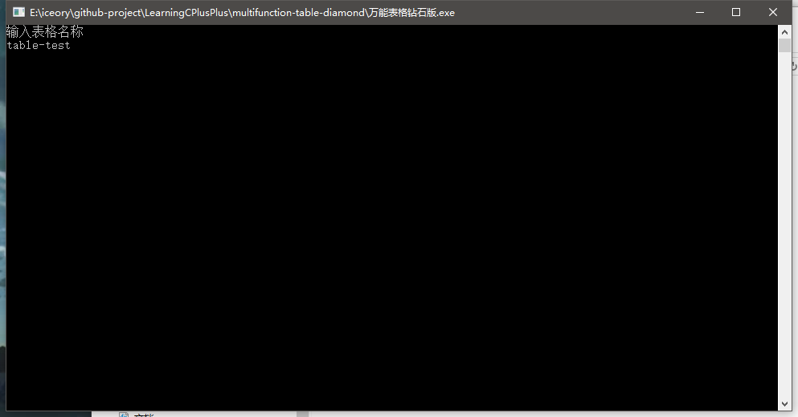
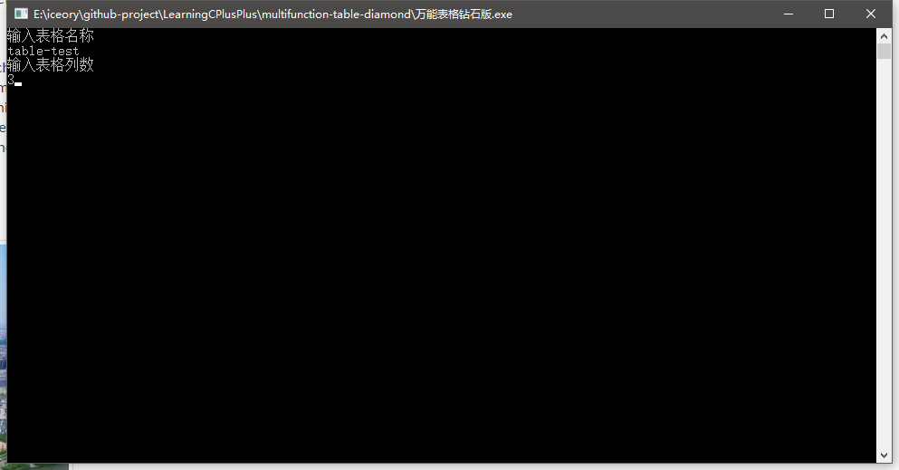
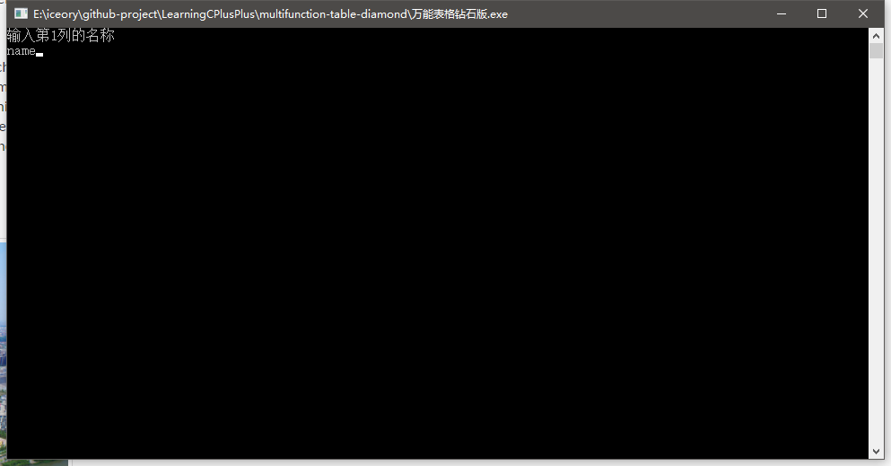
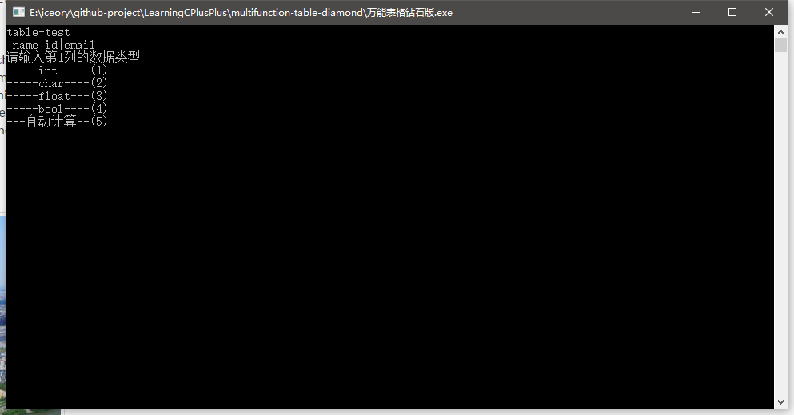
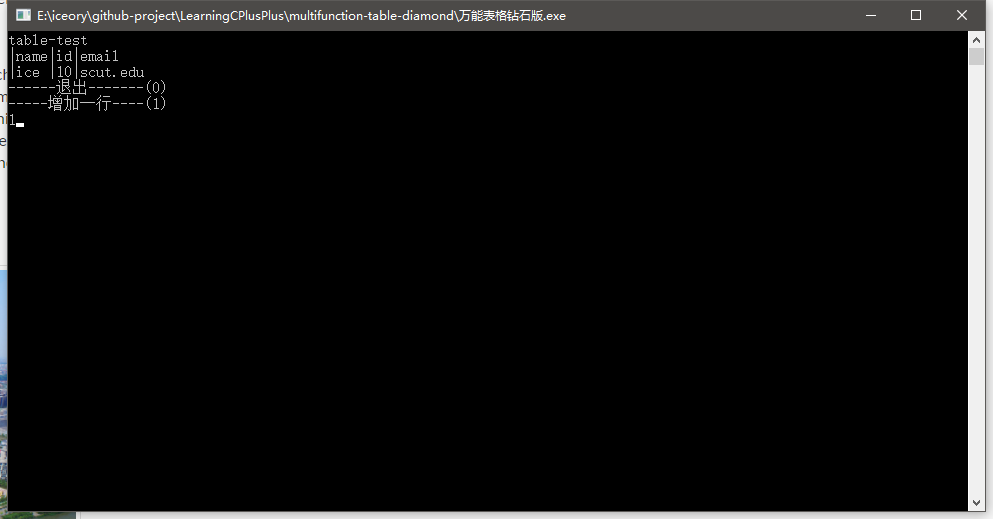
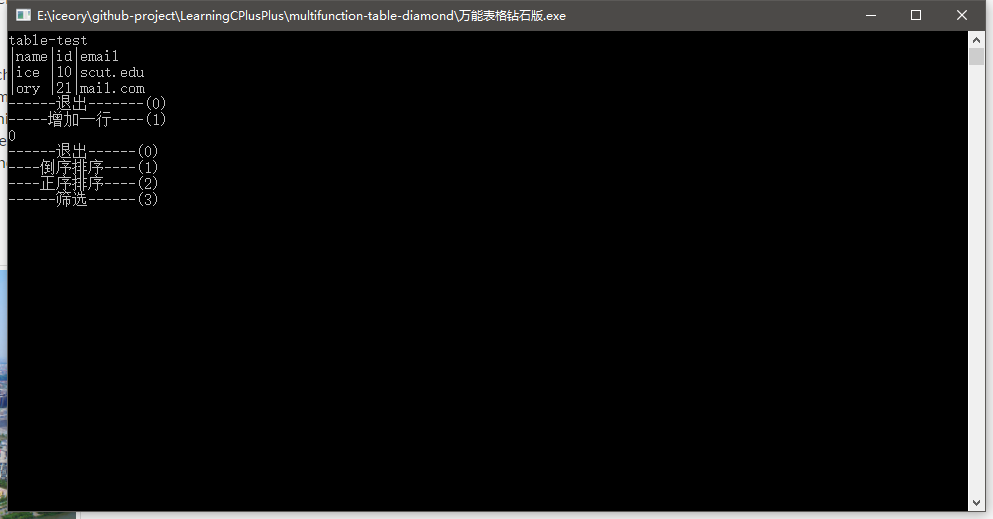
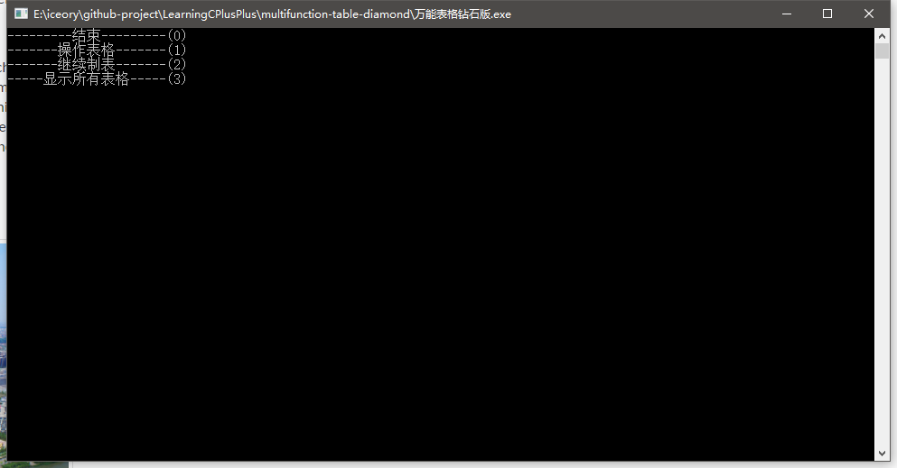
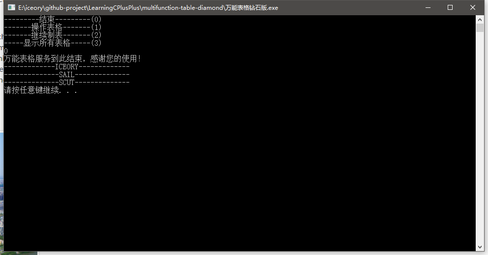

## Multi-Function Table Diamond

### 功能说明

1. 输入表格名称，定义列数、列名称
2. 定义列数据类型、输入列数据
3. 新增功能：对数据进行自动计算
4. 进行正序、倒序排序以及数据筛选
5. 退出后可以选择继续创建表格或者选择所有创建的表格
6. 继续退出之后显示退出界面

### 代码说明

代码没有说明，请看源码

### 结果展示

